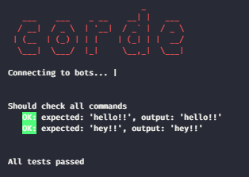

# corde Testing

[](https://circleci.com/gh/lucasgmagalhaes/corde)
[](https://app.fossa.com/projects/git%2Bgithub.com%2Flucasgmagalhaes%2Fcorde?ref=badge_shield)
[](https://www.codefactor.io/repository/github/lucasgmagalhaes/corde)
[](https://codecov.io/gh/lucasgmagalhaes/corde)

corde is a typescript library to create automated tests for discord bots

## How it works ?

Corde uses two bots to send messages between then, the first one is the 'fake user', who will send the real bot.
The second one, is the bot that you want to test the commands. After configure which one is the fake user and the test bot,
you can write your case tests like this:

```ts
afterLogin(async () => {
  handler(commandHandler);
  await group('Should check all commands', async () => {
    await command('hello').shouldRespond('hello!!');
    await command('hey').shouldRespond('hey!!');
  });
});
```

The `handle` is an function that gets your bot messages request. i.e:

```ts
function commandHandler(msg: Discord.Message) {
  const args = msg.content
    .slice(getConfig().botPrefix.length)
    .trim()
    .split(/ +/g);

  const command = args[0].toLowerCase();

  if (command === 'hello' || command === 'h') {
    hello(msg);
  } else if (command === 'hey') {
    hey(msg);
  }
}
```

This is the result made by the simple unitary test:



## Getting started

- create a file in the root of your application called `corde.json` with the following properties:

```js
{
  /* Token of the bot that will talk to your bot (a fake one) */
  "cordeTestToken": "",
  /* Your bot id */
  "botTestId": "",
  /* Your bot token */
  "botTestToken": "",
  /* Guild id where messages will be sent */
  "guildId": "",
  /* Channel id where messages will be sent */
  "channelId": "",
  /* Timeout for response wait */
  "timeOut": 10000,
  /* Prefix to be put before send messages */
  "botPrefix": "!",
  /* Folder with test file folder. CORDE DOES NOT SUPPORT MULTIPLE FILES YET */
  "testFilesDir": ""
}
```

- execute `yarn corde --run` or `npm run corde --run`;
