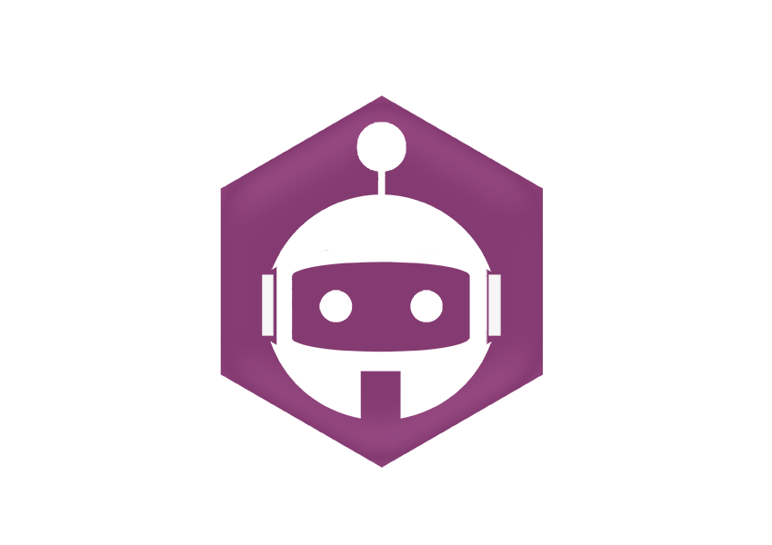

<div align="center">
  <br />
  <p>
    
  </p>
  <p>
   <!-- <a href="https://discord.gg/f3Gs7uU">
      
    </a> -->
    <a href="https://circleci.com/gh/lucasgmagalhaes/corde">
      
    </a>
    <a href="https://codecov.io/gh/lucasgmagalhaes/corde">
      
    </a>
    <a href="https://www.npmjs.com/package/corde">
      
    </a>
    <a href="https://nodei.co/npm/corde/">
      </a>
  </p>
</div>

## 😀 Table of Content

- [About](#-about)
- [Getting Started](#-getting-started)
- [Configurations](#%EF%B8%8F-configurations)

## 👀 About

Corde is a small testing library for Discord.js. As there is a tool to create bots for Discord, it's cool to also have a tool to test then. Corde objective is to be simple, fast and readable to delevopers, such as many others unity test tool around the web.

## Documentation

The bellow documentation is a resume of what you can find in [Corde's site](https://corde.netlify.app)

## 🚀 Getting started

**Node.js 12.0.0 or newer is required**

Starting create tests with Corde is realy simple. First install it locally with npm `npm i -D corde` or yarn `yarn add -D corde`. You can also install it globally: `npm i -g corde` or `yarn global add corde`.

After installed, add the file `corde.json` in root of your application with the follow structure:

```javascript
{
	"cordeTestToken":  "YOUR_TESTING_BOT_TOKEN_HERE",
	"botTestId":  "YOUR_TESTING_BOT_ID_HERE",
	"botTestToken":  "YOUR_BOT_TOKEN_HERE",
	"guildId":  "THE_GUID_OF_BOT_HERE",
	"channelId":  "CHANNELS_ID_HERE",
	"botPrefix":  "+",
	"testFiles":  ["./test"]
}
```

Check the Config section for a more detailed explanation of each configuration propertie.

Now that the config file is created, let's create some tests. You can keep the unity test natural file name structure, creating a `bot.test.js` with the follow structure:

```javascript
const { group, test, command, beforeStart, afterAll } = require("corde");
const { client, loginBot } = require("..");

beforeStart(() => {
  loginBot();
});

group("main commands", () => {
  test("ping command must return... Ping?!!", () => {
    expect("ping").toReturn("Ping?");
  });
});

afterAll(() => {
  client.destroy();
});
```

What is happenning ?

1. `beforeStart` is a fuction that is used to run something **before** the execution of tests. Put there the instruction that makes the bot login i.e. You can also start the bot and then run all tests, with that, there is no need of use `beforeStart` function.
2. `group` Is a collections of tests that referes to some sort of tests.
3. `test` Is the container of a test. it's describe what will be tested, and what is the expectation.
4. `command` is the core of Corde, that is what really with validade if a command is or not executing what it should. The simpliest action that a bot can do is send a plain message, with that, `command` has a collections of options of expectations of response of the bot, in this case, is tested that a command _ping_ should return _pong_. 5)`afterAll` is a fuction that is used to run something **after** the execution of tests. Put there the instructions that make the logoff of the bot, i.e.

## ⚙️ Configurations

| Option         | Description                                          |
| -------------- | ---------------------------------------------------- |
| cordeTestToken | Bot's token that will send commands to the test bot. |
| botTestId      | Bot's id that is being tested.                       |
| botTestToken   | Bot's token of your tested bot.                      |
| botTestId      | Bot's id that is testing.                            |
| guildId        | Guild that your and the test bot are.                |
| channelId      | Channel that your and the test bot are.              |
| botPrefix      | Bot invoke command prefix                            |
| testFiles      | Path were all tests files are                        |
